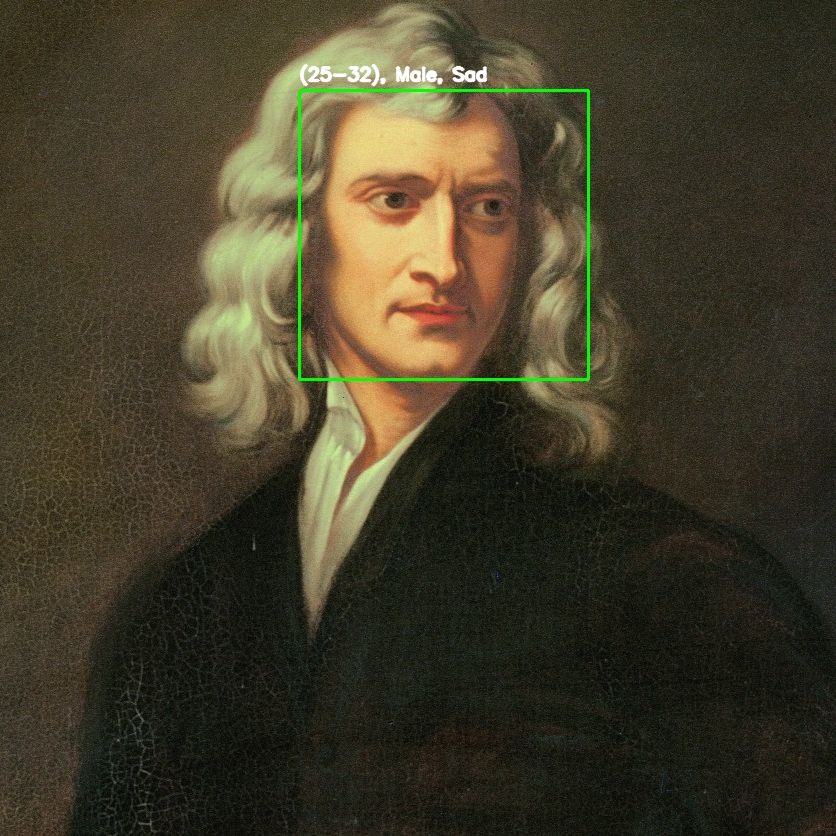

#  CNN-Based Age, Gender & Emotion Detection

A deep learning-based computer vision project that detects **age**, **gender**, and **emotion** from images or live video feed.  
The project uses **Convolutional Neural Networks (CNN)** for emotion recognition and **OpenCV DNN** models for age and gender detection.


## Project Structure

```
Emotion-Age-and-Gender-Detection-Using-CNN
│
├── age_detection_models/
│   ├── age_deploy.prototxt
│   ├── age_net.caffemodel
│
├── emotional_detection/
│   ├── logs/
│   │   └── emotion_log.csv
│   ├── models/
│   │   └── model_16.h5
│   └── src/
│       ├── live_predictor.py
│       ├── model.py
│       ├── model_architecture.py
│       └── preprocessing.py
│
├── gender_detection/
│   ├── models/
│   │   └── model.keras
│   └── src/
│       ├── live_predictor.py
│       ├── model.py
│       ├── model_architecture.py
│       └── preprocessing.py
├── predictors/
│   └── unified_predictor.py
│   └── unified_test.py
│ 
├── logs/
│   └── unified_log.csv
│
│
├── test/
│   ├── test_image.jpeg
│   └── test_image_annotate.jpeg
│
├── gitignore
│   
├── gitattributes
│
└── requirements.txt

````

---

##  Research Overview

The **research** for this project focused on three main computer vision tasks:

### 1️. Emotion Detection
- **Model:** Custom CNN trained from scratch on a labeled dataset of facial expressions.
- **Input Size:** 48×48 grayscale images.
- **Classes:** Angry, Disgust, Fear, Happy, Sad, Surprise, Neutral.
- **Preprocessing:** Face detection (Haar Cascade), normalization (0–1 range), resizing.
- **Loss Function:** Categorical Crossentropy.
- **Optimizer:** Adam with learning rate decay.

### 2️. Age Estimation
- **Model:** Pretrained Caffe-based age prediction network.
- **Input Size:** 227×227 color images.
- **Labels:** 8 age ranges — (0–2), (4–6), (8–12), (15–20), (21–24), (25–32), (33–37), (38–43) ...
- **Method:** Blob extraction + forward pass in OpenCV DNN.

### 3️. Gender Classification
- **Model:** MobileNetV2.
- **Labels:** Male, Female.
- **Input Size:** 48×48 color images.

---

##  Dataset Sources

- **Emotion Detection:** [FER-2013](https://www.kaggle.com/datasets/msambare/fer2013) facial emotion dataset.
- **Age & Gender Detection:** [Gender Recognition Dataset](https://www.kaggle.com/datasets/rashikrahmanpritom/gender-recognition-dataset) for pretraining Caffe models.

---

## Example Output

Below is an example of age, gender, and emotion detection on an image:



---

##  How to Run

1. **Clone the repository**
```bash
git clone https://github.com/Sevak-Grigoryan/Emotion-Age-and-Gender-Detection-Using-CNN.git
```
```bash
cd Emotion-Age-and-Gender-Detection-Using-CNN
````

2. **Install dependencies**

   Make sure you’re using **Python 3.10** before installing.
```bash
py -3.10 -m venv venv
```
```bash
./venv/Scripts/activate
```
```bash
pip install -r requirements.txt
```

3. **Run Live Detection**
```bash
cd predictors
```
```bash
py unified_predictor.py
```

4. **Test on an Image**
```bash
cd predictors
```
```bash
py unified_test.py
```
5. **Run Models Separately**
    
    If you want to test each detection model independently, navigate to the respective folder and run its `live_predictor.py` script. For example:
```bash
cd emotional_detection/src
```
```bash
py live_predictor.py

```

